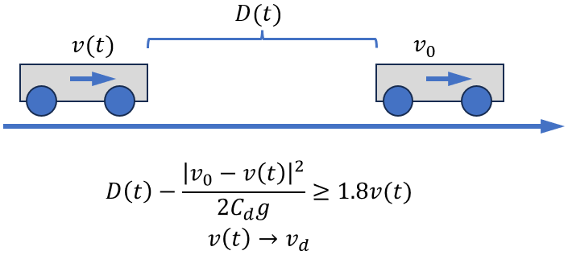
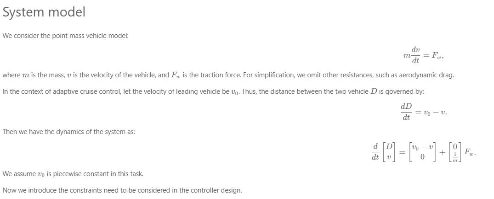
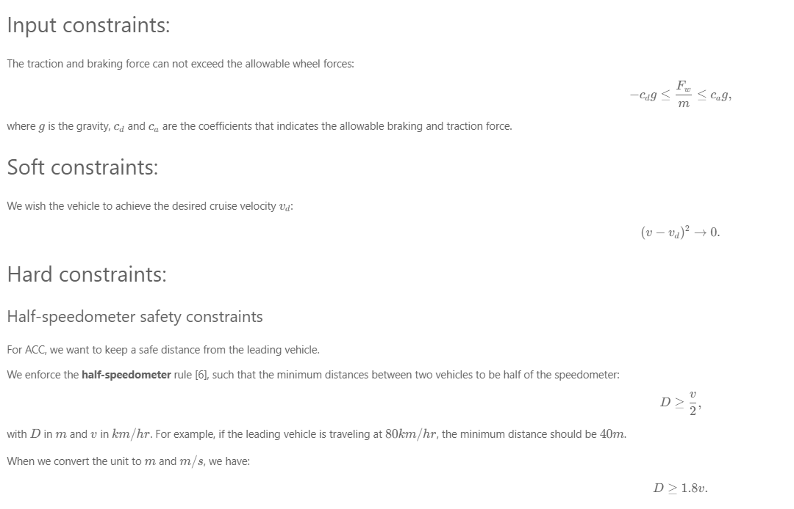
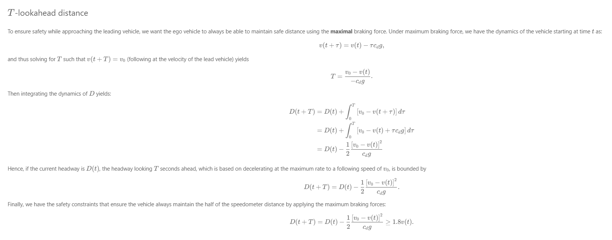
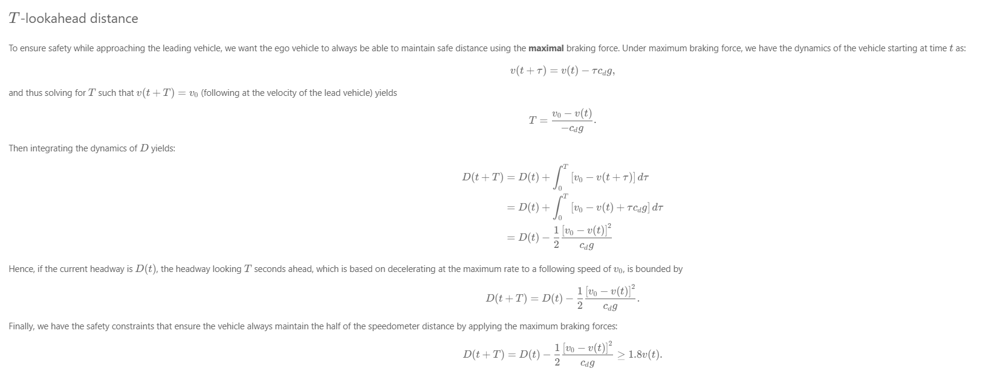
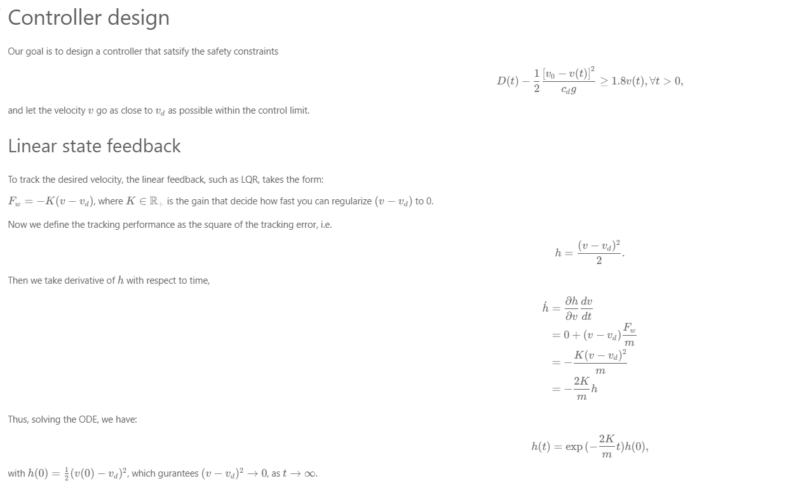
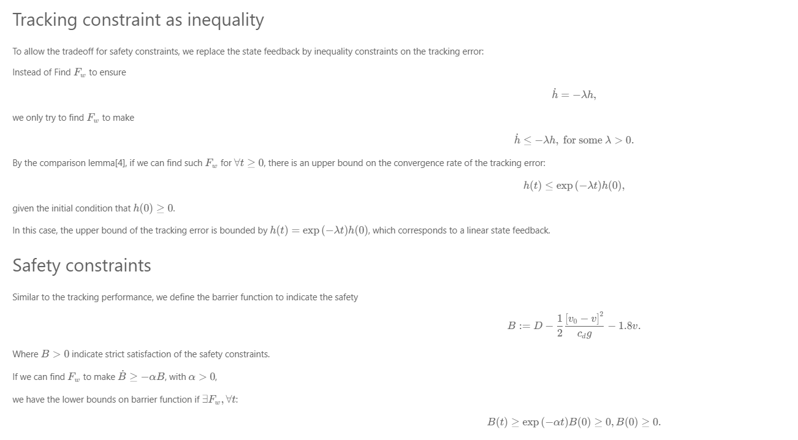
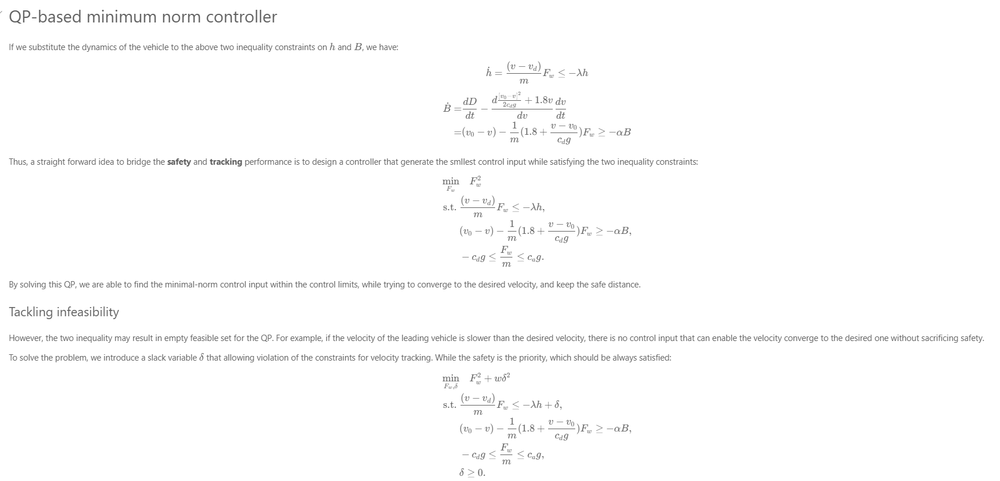
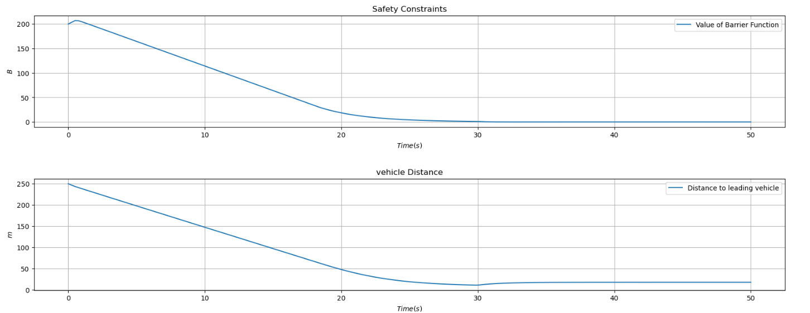
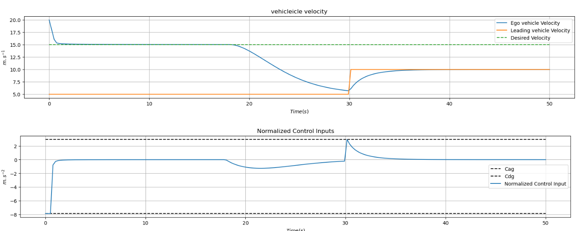

# Adaptive-cruise-control-using-LQR

Safety is critical in autonomous driving. In this task, you will design an optimization based safety-critical controller that enables the vehicle to keep a safe distance to the leading vehicle while trying to reach the desired cruise velocity. 

The key of this problem is the tradeoff between the **safety** and **tracking** of desired velocity. 

